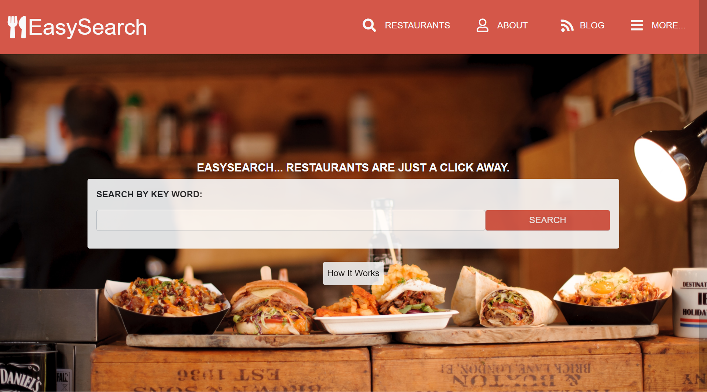
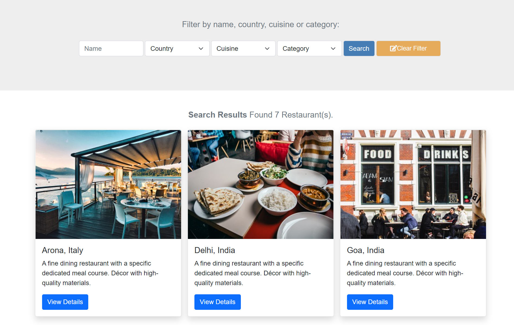
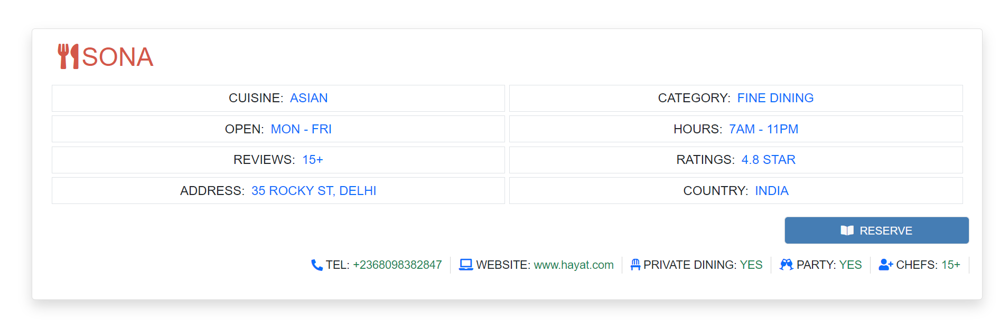

# EasySearch - A Directory of Restaurants

> HTML & CSS Capstone Project (EasySearch - A online directory of restaurants)
A responsive website built following the original project specifications from [Microverse Capstone Project - Directory of Schools](https://www.notion.so/HTML-CSS-capstone-project-Directory-of-Schools-eea352bfaf3e4a83b2917df1f9a4e140)

### Main page

### Search results page

### Details page

Project requirements included using semantic HTML tags, CSS selectors, HTML elements box model (margin, padding, width, height), Bootstrap, creating UIs adaptable to different screen sizes using mediaqueries and using industry-standard tools (flexbox) to place elements on the page.

The project was created using the [design](https://www.behance.net/gallery/25563385/PatashuleKE) of Matthew Njuguna & Sam Achola (Behance).

The project has 3 web pages - the main page, the search results page and the details page.

## Built With

- HTML5
- CSS3 Media Queries
- Bootstrap

## Live Demo

[Live Demo Link](https://zeenatlawal.github.io/Directory-of-Restaurants/)

## Getting Started

To get a local copy up and running follow these simple example steps.

### Prerequisites

- Web browser (e.g. Google chrome or Firefox)
- Code Editor (e.g. Vscode or Atom)

### Cloning the repo

- Copy this link [Directory-of-Restaurants](https://github.com/ZeenatLawal/Directory-of-Restaurants.git)
- Open your terminal or command line in the folder you want the project to be
- Run the command git clone with the link you copied above `git clone https://github.com/ZeenatLawal/Directory-of-Restaurants.git`
- Open the folder with your code editor and run the index.html file using a live server

## Author

👤 **Zeenat Lawal**

- GitHub: [@ZeenatLawal](https://github.com/ZeenatLawal)
- Twitter: [@lawal_zeenat](https://twitter.com/lawal_zeenat)
- LinkedIn: [Zeenat Lawal](https://www.linkedin.com/in/zeenatlawal/)

## 🤝 Contributing

Contributions, issues, and feature requests are welcome!

Feel free to check the [issues page](https://github.com/ZeenatLawal/Directory-of-Resturants/issues/1).

## Show your support

Give a ⭐️ if you like this project!

## Acknowledgments

- Matthew Njuguna & Sam Achola (Design from [Behance](https://www.behance.net/gallery/25563385/PatashuleKE))
- Images from [Unsplash](https://unsplash.com/)
- Icons from [Font Awesome](https://fontawesome.com/)

## 📝 License

This project is [MIT](https://github.com/git/git-scm.com/blob/master/MIT-LICENSE.txt) licensed.
